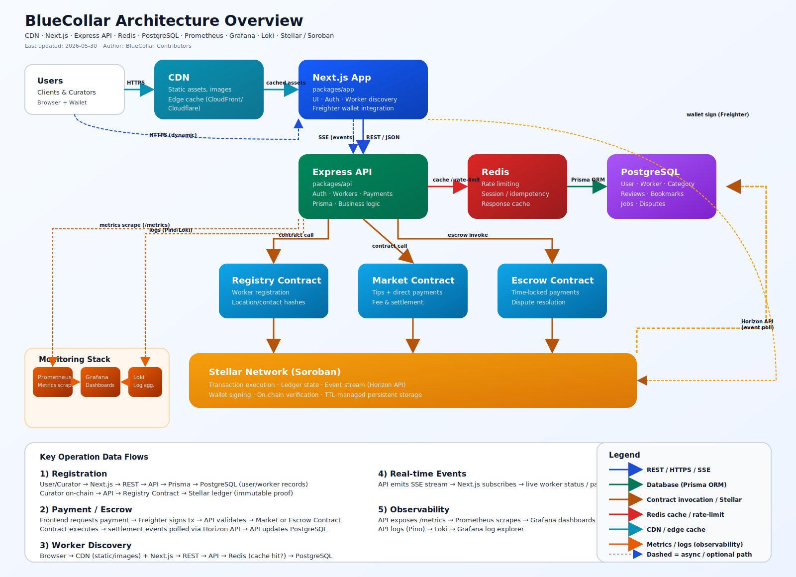

# BlueCollar

> Encontre Profissionais Qualificados Perto de Você

[](https://github.com/Fidelis900/Blue-Collar/actions/workflows/ci.yml)
[](https://github.com/Fidelis900/Blue-Collar/actions/workflows/api-tests.yml)
[](https://nodejs.org)
[](https://pnpm.io)
[](./packages/api/LICENSE)

**[English](./README.md) | Português**

BlueCollar é um **protocolo descentralizado construído em [Stellar](https://stellar.org)** que conecta profissionais qualificados locais (encanadores, eletricistas, carpinteiros, soldadores e muito mais) com usuários através de listagens curadas pela comunidade. A plataforma cria um ecossistema sem confiança onde profissionais podem ser descobertos, verificados e compensados com segurança — sem depender de intermediários centralizados.

Muitos profissionais qualificados carecem de uma plataforma para se destacarem. Enquanto isso, inúmeras pessoas precisam de recomendações de qualidade para profissionais confiáveis. BlueCollar é a ponte que conecta ambos os mundos.

---

## Índice

- [Visão Geral](#visão-geral)
- [Arquitetura](#arquitetura)
- [Estrutura do Monorepo](#estrutura-do-monorepo)
- [Pacotes](#pacotes)
  - [API](#api-packagesapi)
  - [Contratos](#contratos-packagescontracts)
  - [App](#app-packagesapp)
- [Referência da API](#referência-da-api)
- [Contratos Inteligentes](#contratos-inteligentes)
- [Começando](#começando)
- [Variáveis de Ambiente](#variáveis-de-ambiente)
- [Implantação em Produção](#implantação-em-produção)
- [Roteiro](#roteiro)
- [Comunidade](#comunidade)
- [Contribuindo](#contribuindo)
- [Licença](#licença)
- [Guia de Início Rápido](packages/api/QUICK_START_GUIDE.md)
- [Documentação da API](packages/api/DOCUMENTATION.json)
- [Exemplos cURL da API](packages/api/CURL_EXAMPLES.md)
- [Política de Segurança](packages/api/SECURITY.md)
- [Guia de Contribuição](CONTRIBUTING.md)
- [Código de Conduta](CODE_OF_CONDUCT.md)
- [Guia de Contribuição do Frontend](packages/app/CONTRIBUTING.md)

---

## Visão Geral

| Recurso                    | Descrição                                                                                    |
| -------------------------- | -------------------------------------------------------------------------------------------- |
| Listagens descentralizadas | Perfis de profissionais são ancorados on-chain via contratos Soroban do Stellar              |
| Curação comunitária        | Curadores (membros verificados da comunidade) criam e gerenciam listagens de profissionais   |
| Pagamentos sem confiança   | Gorjetas e pagamentos fluem diretamente entre usuários e profissionais via contrato Market   |
| Google OAuth               | Usuários podem fazer login com Google além de email/senha                                    |
| Acesso baseado em função   | Três funções: `user`, `curator`, `admin`                                                     |
| Upload de mídia            | Imagens de perfil tratadas com requisições PUT com spoofing de método (multipart/form-data)  |

---

## Arquitetura



```
Usuário / Navegador
      │
      ▼
 [Next.js App]  ──────────────────────────────────────────────────────────┐
      │                                                                    │
      ▼                                                                    ▼
 [BlueCollar API]  (Node.js / Express / TypeScript)          [Rede Stellar]
      │                                                                    │
      ▼                                                                    ▼
 [PostgreSQL via Prisma]                              [Contratos Soroban]
                                                       ├── Contrato de Registro
                                                       └── Contrato de Mercado
```

- A **API** gerencia autenticação, gerenciamento de categorias e CRUD de profissionais. Armazena dados em PostgreSQL via ORM Prisma.
- O **Contrato de Registro** (Rust/Soroban) ancora registros de profissionais no blockchain Stellar, fornecendo prova imutável de listagem.
- O **Contrato de Mercado** (Rust/Soroban) gerencia transferências de tokens diretas (gorjetas/pagamentos) entre usuários e profissionais usando tokens Stellar (XLM ou ativos personalizados).
- O **App** é um frontend Next.js que consome a API e interage com carteiras Stellar (Freighter, etc.).

Nota de manutenção do diagrama: atualize `docs/architecture/system-overview.svg` sempre que houver mudanças nas relações arquitetônicas principais ou fluxos de dados.

---

## Estrutura do Monorepo

```
bluecollar/
├── packages/
│   ├── api/                  # API backend Node.js/Express (TypeScript)
│   │   ├── prisma/
│   │   │   └── schema.prisma
│   │   ├── src/
│   │   │   ├── controllers/  # Manipuladores de rota
│   │   │   ├── middleware/   # Autenticação, validação
│   │   │   ├── routes/       # Roteadores Express
│   │   │   ├── services/     # Lógica de negócio
│   │   │   ├── models/       # Definições de tipo
│   │   │   ├── mailer/       # Modelos e transporte de email
│   │   │   ├── database/     # Scripts de seed
│   │   │   ├── utils/        # Auxiliares
│   │   │   ├── db.ts         # Singleton do cliente Prisma
│   │   │   └── index.ts      # Ponto de entrada da aplicação
│   │   ├── .env.example
│   │   ├── package.json
│   │   └── tsconfig.json
│   │
│   ├── contracts/            # Contratos inteligentes Stellar Soroban (Rust)
│   │   ├── contracts/
│   │   │   ├── registry/     # Contrato de registro de profissionais
│   │   │   │   └── src/lib.rs
│   │   │   └── market/       # Contrato de gorjeta/pagamento
│   │   │       └── src/lib.rs
│   │   └── Cargo.toml
│   │
│   └── app/                  # Frontend Next.js
│       ├── src/
│       └── package.json
│
├── package.json              # Configuração do workspace raiz
├── pnpm-workspace.yaml
└── README.md
```

---

## Pacotes

### API (`packages/api`)

A API REST backend construída com **Node.js**, **Express** e **TypeScript**. Usa **Prisma** como ORM contra um banco de dados PostgreSQL.

**Módulos principais:**

| Módulo                      | Propósito                                         |
| --------------------------- | ------------------------------------------------- |
| `controllers/auth.ts`       | Login, registro, logout, redefinição de senha    |
| `controllers/workers.ts`    | CRUD para listagens de profissionais              |
| `controllers/categories.ts` | Listagem e busca de categorias                    |
| `middleware/auth.ts`        | Autenticação JWT + autorização baseada em função |
| `prisma/schema.prisma`      | Schema do banco de dados (User, Worker, Category) |

**Stack de tecnologia:** Express · TypeScript · Prisma · PostgreSQL · Argon2 · JWT · Passport (Google OAuth) · Nodemailer · Vitest

---

### Contratos (`packages/contracts`)

Contratos inteligentes **Soroban** do Stellar escritos em **Rust**.

#### Contrato de Registro

Gerencia registros de profissionais on-chain. Profissionais são armazenados no armazenamento persistente do contrato com chave de um id `Symbol` único.

```
register(id, owner, name, category)  → armazena Profissional on-chain
get_worker(id)                        → retorna struct Worker
toggle(id, caller)                    → alterna is_active (apenas proprietário)
list_workers()                        → retorna todos os ids de profissionais
upgrade(admin, new_wasm_hash)         → atualiza WASM do contrato (apenas admin)
```

#### Contrato de Mercado

Gerencia transferências de tokens diretas (gorjetas/pagamentos) entre usuários e profissionais.

```
tip(from, to, token_addr, amount)  → transfere tokens Stellar de usuário para profissional
upgrade(admin, new_wasm_hash)      → atualiza WASM do contrato (apenas admin)
```

Ambos os contratos são compilados para WASM e implantados na rede Stellar (testnet / mainnet).

---

### App (`packages/app`)

Frontend Next.js 14. Conecta-se à API BlueCollar e integra-se com carteiras Stellar (Freighter) para interações on-chain.

---

## Referência da API

URL Base: `http://localhost:3000/api`

### Autenticação

| Método   | Endpoint                | Descrição                        |
| -------- | ----------------------- | -------------------------------- |
| `POST`   | `/auth/login`           | Login com email + senha          |
| `POST`   | `/auth/register`        | Criar nova conta                 |
| `PUT`    | `/auth/verify-account`  | Verificar endereço de email      |
| `DELETE` | `/auth/logout`          | Logout (requer autenticação)     |
| `POST`   | `/auth/forgot-password` | Solicitar email de redefinição   |
| `PUT`    | `/auth/reset-password`  | Redefinir senha com token        |
| `GET`    | `/auth/google`          | Iniciar Google OAuth             |
| `GET`    | `/auth/google/callback` | Callback do Google OAuth         |

**Exemplo de resposta de login:**

```json
{
  "data": {
    "id": "clxyz...",
    "email": "usuario@exemplo.com",
    "firstName": "Jane",
    "lastName": "Doe",
    "role": "user",
    "verified": true
  },
  "status": "success",
  "message": "Login bem-sucedido",
  "code": 202,
  "token": "<jwt>"
}
```

### Categorias

| Método | Endpoint          | Descrição                |
| ------ | ----------------- | ------------------------ |
| `GET`  | `/categories`     | Listar todas as categorias |
| `GET`  | `/categories/:id` | Obter uma categoria única |

### Profissionais (Curador)

| Método   | Endpoint                              | Descrição                                  | Autenticação |
| -------- | ------------------------------------- | ------------------------------------------ | ------------ |
| `GET`    | `/workers`                            | Listar profissionais ativos (paginado)     | Pública      |
| `GET`    | `/workers/:id`                        | Obter um profissional único                | Pública      |
| `POST`   | `/workers`                            | Criar listagem de profissional             | Curador      |
| `POST`   | `/workers/:id` + `X-HTTP-Method: PUT` | Atualizar profissional (suporta upload)    | Curador      |
| `DELETE` | `/workers/:id`                        | Deletar profissional                       | Curador      |
| `PATCH`  | `/workers/:id/toggle`                 | Alternar status ativo                      | Curador      |

> **Spoofing de método para uploads de arquivo:** Formulários HTML e requisições `multipart/form-data` suportam apenas `GET`/`POST`. Para atualizar um profissional com upload de arquivo, envie uma requisição `POST` com o header `X-HTTP-Method: PUT`. A API usa o middleware [`method-override`](https://www.npmjs.com/package/method-override) para reescrever o método da requisição para `PUT` antes de chegar ao manipulador de rota, então a rota de atualização se comporta identicamente a um `PUT` padrão.
>
> ```
> POST /api/workers/:id
> Content-Type: multipart/form-data
> X-HTTP-Method: PUT
> ```

### Admin

Os endpoints de admin espelham os endpoints de Curador, mas são escopo da função `admin` e incluem operações em massa.

---

## Contratos Inteligentes

### Pré-requisitos

- [Rust](https://rustup.rs/) com target `wasm32-unknown-unknown`
- [Stellar CLI](https://developers.stellar.org/docs/tools/developer-tools/cli/stellar-cli)

```bash
rustup target add wasm32-unknown-unknown
cargo install --locked stellar-cli
```

### Compilar

```bash
cd packages/contracts
cargo build --release --target wasm32-unknown-unknown
```

### Implantar em Testnet

```bash
stellar contract deploy \
  --wasm target/wasm32-unknown-unknown/release/bluecollar_registry.wasm \
  --source <sua-chave-secreta> \
  --network testnet
```

### Atualizar um Contrato

Para atualizar um contrato implantado sem reimplantar (preservando seu ID de contrato e armazenamento):

1. Compile o novo WASM e instale-o on-chain para obter seu hash:

```bash
stellar contract install \
  --wasm target/wasm32-unknown-unknown/release/bluecollar_registry.wasm \
  --source <sua-chave-secreta> \
  --network testnet
# outputs: <novo_hash_wasm>
```

2. Invoque a função `upgrade` com o endereço do admin:

```bash
stellar contract invoke \
  --id <id-contrato> \
  --source <chave-secreta-admin> \
  --network testnet \
  -- upgrade \
  --admin <endereco-admin> \
  --new_wasm_hash <novo-hash-wasm>
```

Os mesmos passos se aplicam ao contrato de Mercado. O argumento `admin` deve corresponder à chave de assinatura (`--source`), pois `require_auth()` é aplicado on-chain.

### Estratégia de TTL de Armazenamento

As entradas de armazenamento persistente do Soroban têm um TTL (time-to-live) medido em ledgers. Sem extensão, as entradas podem expirar e ser removidas do ledger.

| Constante       | Valor           | Duração aproximada     |
| --------------- | --------------- | ---------------------- |
| `TTL_EXTEND_TO` | 535.000 ledgers | ~1 ano (a 5s/ledger)   |
| `TTL_THRESHOLD` | 267.500 ledgers | ~6 meses               |

**Como funciona:**

- Cada escrita no armazenamento persistente (`register`, `toggle`) chama automaticamente `extend_ttl` na chave afetada.
- `extend_ttl(key, threshold, extend_to)` apenas estende se o TTL atual estiver abaixo de `threshold`, evitando taxas desnecessárias.
- Uma função pública `extend_worker_ttl(id)` está disponível para que qualquer pessoa (usuários, bots, o app) possa atualizar o TTL de uma entrada de profissional sem precisar de permissões especiais.

```bash
# Estender TTL de um profissional via CLI
stellar contract invoke \
  --id <id-contrato> \
  --source <qualquer-conta> \
  --network testnet \
  -- extend_worker_ttl \
  --id <id-profissional>
```

---

## Docker

A forma mais rápida de executar a API e o banco de dados localmente é com Docker Compose.

```bash
# Copie e preencha o arquivo env da API primeiro
cp packages/api/.env.example packages/api/.env

# Inicie API + PostgreSQL + Adminer
pnpm docker:up

# Pare e remova containers
pnpm docker:down
```

| Serviço         | URL                   |
| --------------- | --------------------- |
| API             | http://localhost:3000 |
| Adminer (DB UI) | http://localhost:8080 |
| PostgreSQL      | localhost:5432        |

> O container da API executa `prisma migrate deploy` automaticamente na inicialização.

---

## Começando

### Pré-requisitos

- Node.js >= 20
- pnpm >= 9
- PostgreSQL
- Rust (para contratos)

### Instalar

```bash
git clone https://github.com/Fidelis900/Blue-Collar.git
cd Blue-Collar
pnpm install
```

### Executar a API

```bash
cp packages/api/.env.example packages/api/.env
# preencha DATABASE_URL e JWT_SECRET

cd packages/api
pnpm migrate       # executar migrações prisma
pnpm seed          # seed de categorias
pnpm dev           # iniciar servidor dev em :3000
```

### Executar o App

```bash
cd packages/app
pnpm dev           # iniciar Next.js em :3001
```

---

## Variáveis de Ambiente

Todas as variáveis da API vivem em `packages/api/.env` (copie de `.env.example`):

| Variável               | Descrição                                  |
| ---------------------- | ------------------------------------------ |
| `DATABASE_URL`         | String de conexão PostgreSQL               |
| `JWT_SECRET`           | Chave secreta para assinar JWTs            |
| `PORT`                 | Porta da API (padrão: 3000)                |
| `GOOGLE_CLIENT_ID`     | ID do cliente Google OAuth                 |
| `GOOGLE_CLIENT_SECRET` | Segredo do cliente Google OAuth            |
| `MAIL_HOST`            | Host SMTP                                  |
| `MAIL_PORT`            | Porta SMTP                                 |
| `MAIL_USER`            | Usuário SMTP                               |
| `MAIL_PASS`            | Senha SMTP                                 |
| `APP_URL`              | URL pública do app (usada em emails)       |

---

## Implantação em Produção

Use o runbook de produção em [docs/PRODUCTION_DEPLOYMENT.md](./docs/PRODUCTION_DEPLOYMENT.md) para:

- Configuração de ambiente da API/app/banco de dados
- Exemplos de produção do Docker
- Configuração de proxy reverso SSL/TLS
- Recomendações de monitoramento e logging
- Procedimentos de backup e recuperação de desastres

---

## Roteiro

| Status         | Recurso                                                 |
| -------------- | ------------------------------------------------------- |
| ✅ Concluído   | CRUD de profissional com listagens controladas por curador |
| ✅ Concluído   | Autenticação JWT + verificação de email + redefinição de senha |
| ✅ Concluído   | Google OAuth 2.0                                        |
| ✅ Concluído   | Contratos Soroban de Registro & Mercado (testnet)       |
| ✅ Concluído   | Pagamentos em caução com cancelamento com tempo limite   |
| ✅ Concluído   | Acesso baseado em função (user / curator / admin)       |
| ✅ Concluído   | Uploads de imagem de perfil (Multer + Sharp)            |
| 🔄 Em progresso | Frontend Next.js (descoberta de profissional, conexão de carteira) |
| 🔄 Em progresso | Integração de carteira Freighter                        |
| 📋 Planejado   | Implantação em Mainnet                                  |
| 📋 Planejado   | Avaliações e classificações de profissionais            |
| 📋 Planejado   | Notificações push                                       |
| 📋 Planejado   | App móvel (React Native)                                |

---

## Comunidade

Junte-se à conversa e mantenha-se atualizado:

- **Telegram:** [t.me/bluecollar](https://t.me/bluecollar)
- **GitHub Discussions:** [github.com/Fidelis900/Blue-Collar/discussions](https://github.com/Fidelis900/Blue-Collar/discussions)
- **Issues:** [github.com/Fidelis900/Blue-Collar/issues](https://github.com/Fidelis900/Blue-Collar/issues)

---

## Contribuindo

Veja [CONTRIBUTING.md](./CONTRIBUTING.md) para o guia completo, incluindo convenções de mensagem de commit e processo de PR.

1. Verifique os problemas abertos para algo em que trabalhar
2. Faça um fork do repo e crie um branch de recurso
3. Faça suas alterações e abra um pull request

Todos os PRs requerem verificações de CI aprovadas.

---

## Licença

MIT © Colaboradores BlueCollar

---

## Tradução

Esta tradução foi fornecida para tornar o projeto acessível à comunidade de desenvolvedores brasileira e portuguesa. Para manter a tradução sincronizada com a versão em inglês, consulte o [README.md](./README.md) para atualizações.

**Tradutores:** Comunidade BlueCollar
